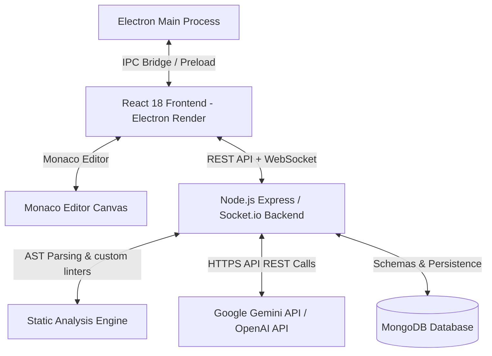
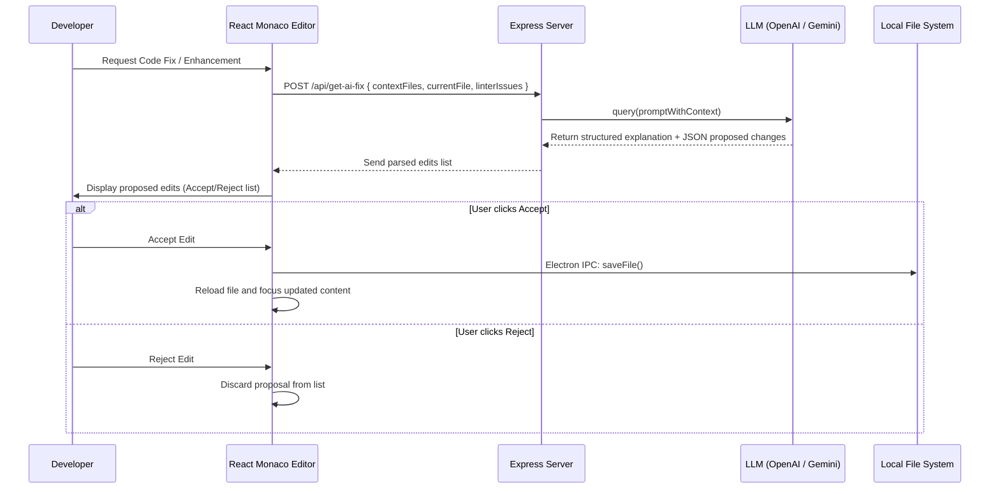
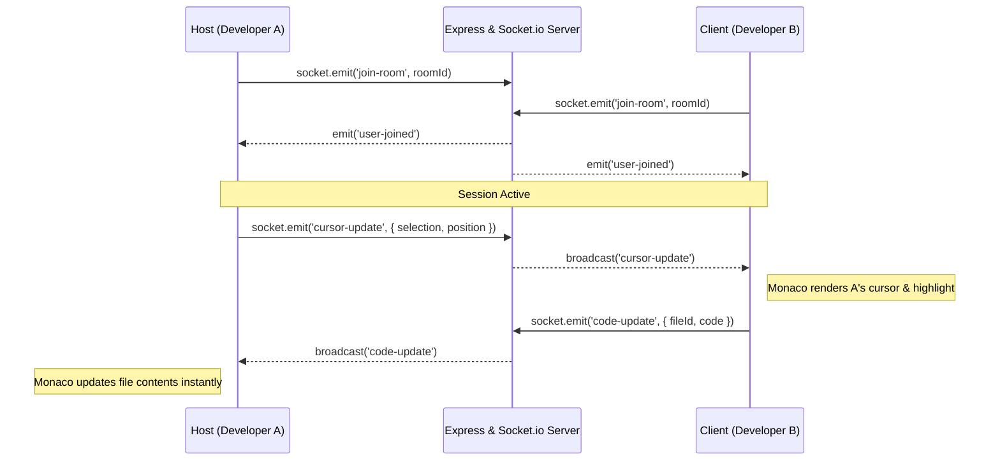

# ⚡ AI Diagnostic Studio (LLM-Powered Frontend IDE)

[](https://www.electronjs.org/)
[](https://react.dev/)
[](https://tailwindcss.com/)
[](https://expressjs.com/)
[](https://socket.io/)
[](https://eslint.org/)
[](LICENSE)

An enterprise-grade, desktop-native code editor and diagnostic IDE featuring **real-time peer collaboration**, **multi-engine AI assistance** with an "Accept/Reject" Git-like diff review flow, **recursive four-tier static code analysis**, and **natural language full-stack autonomous project generation**.

AI Diagnostic Studio is wrapped in a premium, frameless **Electron** desktop shell with a custom, high-contrast dark theme designed to provide professional developers with an ultra-responsive, beautiful, and integrated web development workstation.

---

## 📸 Interface Preview

*(You can embed screenshots or GIFs of your studio here)*
> **Tip:** Showcase the 3-panel workspace, the Socket.io collaboration cursor visualizer, and the Monaco Editor diff system for maximum impact on your GitHub profile!

---

## ✨ Core Pillars & Architectural Highlights

### 💻 1. Professional Frameless Desktop Workspace
*   **VS Code-Inspired 3-Panel Layout:** Seamlessly integrates a sidebar drawer (with File Explorer, Search, AI Chat, and Collaboration Room Manager), a tabbed workspace, and a collapsible bottom drawer (Terminal, ESLint Diagnostics, and System Console).
*   **Frameless Window Control:** Sleek custom window controls (minimize, maximize, close) integrated natively into the top navigation bar with draggable window-drag zones.
*   **Native File Explorer & File Dialogs:** Access your local OS directories directly using native Electron dialog pickers. Fully supports recursive file/directory tree generation, file/folder creation, renames, deletions, and recursive file-saving.
*   **Split Editor Panes:** Fully supports side-by-side file editing (Split Pane Right) with synchronized states, breadcrumbs, individual tab navigation, and local storage configurations.

### 🤖 2. Dual-Engine Autonomous AI Developer
*   **Context-Aware AI Assistant:** Integrated with both **OpenAI (GPT-4o-mini)** and **Google Gemini (Gemini 2.5 Flash)**. Automatically loads active project file contents, cursor coordinate selections, and workspace linter diagnostics as system context.
*   **Accept/Reject Live Diff Workflow:** The AI returns multi-file edits in a structured JSON schema. The IDE renders these changes in a customized split diff editor, allowing developers to review, accept, or reject individual file modifications before writing to disk.
*   **Autonomous Project Generator:** Describe your system architecture or app ideas in natural language. The AI generates a pristine, complete, production-ready project framework (full boilerplates, routers, configurations, and scripts) and automatically writes it to disk.

### 🌐 3. Real-Time Collaborative Workspace
*   **Socket.io Multi-User Sync:** Host or join peer-to-peer coding sessions directly over LAN (Local Area Network) or web.
*   **Live Remote Cursors & Selections:** Visualizes remote developers' cursors, selection highlights, and text edits in real-time inside the Monaco Editor.
*   **Session Chat Room:** Text chat with team members inside the sidebar collaboration panel, complete with custom typing indicators and connection logs.
*   **Visual IDE Screen Sharing:** Capture and send full-screen high-quality IDE screenshots directly over the socket pipeline using integrated `html2canvas` render buffers.
*   **Jump-to-Code Shared Snippets:** Share code blocks directly from your active editor. Teammates can click "Jump to Code" to automatically open and focus the file at the exact matching line number.
*   **Dynamic Socket Re-Routing:** Swap socket backend links on the fly (`http://<LAN_IP>:3001`) to hook into your teammates' dev environments instantly.

### 🔍 4. Multi-Faceted Static Diagnostics
*   **JS/JSX ESLint Diagnostics:** In-memory ESLint parser that reports code violations, unreachable blocks, duplicate keys, and syntax warnings with line/column pointers.
*   **Custom Semantic HTML Linting:** Evaluates image tag accessibility (`alt` attributes), checks structure (unclosed tags, missing `DOCTYPE`, essential structural nodes), and checks for responsive web configuration (viewport and charset metadata).
*   **Custom CSS Optimization & Usage Check:** Analyzes `.css` code for unused classes (cross-checking your HTML/JS files), duplicate selectors, and alerts on strict CSS specificity overrides (`!important`).
*   **Module Import & Path Checker:** Scrapes Javascript code and recursively checks whether local relative imports (`import` or `require`) resolve to existing files on disk, capturing broken dependencies before runtime.

---

## 🛠️ System Architecture

The application splits responsibilities between a desktop Electron wrapper, a local React single-page app, and a Node.js Express & Socket server:

### 📐 High-Level Architecture


### 🔁 AI Diff & Action Pipeline


### 🤝 Real-Time Collaboration Socket Flow


---

## 📁 Repository Structure

```markdown
LLM_Powered_Frontend_Code_editor/
├── electron/                 # Electron Desktop Wrapper
│   ├── main.js               # Main process, starts Express in prod, exposes native FS and shell APIs
│   └── preload.js            # IPC preload bridge (fs operations, system shell command runner)
├── frontend/                 # React 18 SPA (Vite Dev Server)
│   ├── public/               # Public assets and global icons
│   ├── src/
│   │   ├── components/       # IDE Modular Components
│   │   │   ├── ActivityBar.jsx     # Side icon selector (Explorer, Search, AI, Collaboration)
│   │   │   ├── FileExplorer.jsx    # OS Directory navigation tree
│   │   │   ├── EditorPanel.jsx     # Tabbed Monaco Editor with split paneling UI
│   │   │   ├── AIPanel.jsx         # Conversational chat with Accept/Reject diffing lists
│   │   │   ├── CollaborationPanel.jsx # Peer server connection and chat with html2canvas screenshot sharing
│   │   │   ├── GlobalSearch.jsx    # Global file/content fuzzy searcher
│   │   │   ├── IDE.jsx             # Grid wrapper organizing layout panels
│   │   │   ├── WelcomeScreen.jsx   # Interactive startup screen with recent folders
│   │   │   ├── BottomPanel.jsx     # Terminal drawer, ESLint report panel, system loggers
│   │   │   ├── StatusBar.jsx       # Diagnostic summaries and active collaboration badges
│   │   │   ├── TopBar.jsx          # Custom frameless titlebar with custom drag zones
│   │   │   ├── CommandPalette.jsx  # Floating fuzzy file finder
│   │   │   └── TerminalPanel.jsx   # Shell execution window
│   │   ├── context/          # Global state management
│   │   │   └── AppContext.jsx      # Controls open project, tabs, diagnostics, active users
│   │   ├── App.jsx           # IDE grid layout container
│   │   ├── main.jsx          # App bootstrapping
│   │   └── socket.js         # Dynamic Socket.io connection re-router
│   ├── tailwind.config.js    # Design system and grid layout overrides
│   └── package.json          # Frontend dependencies (React, Monaco, Socket.io client)
├── backend/                  # Node.js + Express + Socket.io Server
│   ├── controllers/          # Request handlers
│   │   ├── aiController.js       # JSON-diff AI prompt constructor and parser
│   │   ├── analysisController.js # Workspace compiler and static checks
│   │   ├── fileController.js     # Native fs helpers
│   │   └── projectController.js  # AI Project template constructor
│   ├── models/               # MongoDB models (Mongoose schemas)
│   │   ├── User.js, Project.js   # Client profiles and shared files metadata
│   │   └── Issue.js, AIRecommendation.js # Static issues log and AI telemetry
│   ├── routes/               # API Router bindings
│   ├── services/             # Core Backend Services
│   │   ├── aiService.js          # REST integration for OpenAI and direct Gemini HTTP requests
│   │   └── analyzer.js           # Multi-engine static checker (ESLint, HTML, CSS, paths)
│   ├── server.js             # Main server entry (Socket.io event handler, Express setups)
│   └── package.json          # Backend dependencies (Express, Socket.io, Mongoose, ESLint)
├── package.json              # Root package coordinator (Dev scripts & Electron Builder packaging)
└── dist/                     # Packaged desktop executables (.exe output)
```

---

## 🚀 Installation & Local Setup

Ensure you have [Node.js (v18 or higher)](https://nodejs.org/) installed on your machine. MongoDB is completely optional; the application automatically runs in transient memory mode if no MongoDB URI is supplied.

### Step 1: Clone the Repository
```bash
git clone https://github.com/your-username/LLM_Powered_Frontend_Code_editor.git
cd LLM_Powered_Frontend_Code_editor
```

### Step 2: Install All Dependencies
We have configured a root orchestration command that installs all nested dependencies in `frontend/` and `backend/` in a single command:
```bash
npm run install:all
```

### Step 3: Configure Environment Variables
Create a `.env` file inside the `backend/` directory:

```env
# Server Configuration
PORT=3001

# Database Configuration (Optional. Leave blank to run in offline transient mode)
MONGODB_URI=mongodb://localhost:27017/ai-diagnostic-studio

# AI Configuration (Select: 'openai' or 'gemini')
AI_PROVIDER=gemini

# API Credentials (Input your keys)
OPENAI_API_KEY=your-openai-api-key-here
GEMINI_API_KEY=your-gemini-api-key-here
```

---

## 🏃 Running the Application

### Development Mode (Concurrent)
Launch the Express backend, the Vite dev server, and the Electron desktop browser window concurrently with one terminal command:
```bash
npm run dev
```

### Manual Individual Commands
If you prefer running individual processes in different terminal tabs:
```bash
# 1. Start the Express & Socket.io server
npm run backend:dev

# 2. Start the Vite React hot-reloader
npm run frontend:dev

# 3. Start the desktop Electron runtime
npm run electron:dev
```

---

## 📦 Packaging for Production

To compile, optimize, and pack the entire environment into a standalone desktop application (`.exe` for Windows):

```bash
npm run package
```
This script will:
1. Run `npm run build` in the React frontend folder to generate static bundles.
2. Compile and package the Electron runtime, Express backend, and assets.
3. Generate a production-ready Windows setup installer `.exe` inside the `/dist` directory.

---

## 💡 How it Works Under the Hood

### The AI Split-Diff Workflow
When you request a code enhancement or fix:
1. **Context Collection:** The IDE aggregates open files, current cursor selection, and compile/linter errors.
2. **AI Request:** The Express server issues a tailored system prompt to your chosen LLM (Gemini or OpenAI) requesting a detailed implementation plan followed by a highly structured JSON block listing all file modifications.
3. **Receipt & Review:** The IDE interceptor extracts the JSON file edits.
4. **Interactive Review:** The Monaco editor mounts a split diff panel displaying your local file (left) versus the AI-proposed edit (right). You can selectively click **Accept** to apply changes to your workspace disk space, or click **Reject** to discard them.

### Real-Time Socket Collaboration
When sharing or joining room sessions:
* The client establishes a Socket connection with the active Express backend IP.
* Text inserts, tab-swaps, and selection adjustments map onto standard Monaco cursor positions.
* These details are serialized and broadcast to all connected sockets in that specific room.
* The frontend reads these coordinates and draws absolute floating overlays matching other developers' names and colors, allowing real-time fluid collaboration.

---

## 📡 REST API Reference

The backend exposes a highly robust REST API to support non-Electron clients and auxiliary services.

### 1. AI Actions
#### `POST /api/get-ai-fix`
Requests a targeted fix or code implementation proposal.

*   **Body:**
    ```json
    {
      "message": "Explain what is wrong with this function and fix it.",
      "currentFile": {
        "path": "src/App.jsx",
        "name": "App.jsx",
        "content": "const App = () => { ... }",
        "language": "javascript"
      },
      "contextFiles": [
        {
          "path": "src/components/Button.jsx",
          "name": "Button.jsx",
          "content": "...",
          "language": "javascript"
        }
      ],
      "issues": []
    }
    ```
*   **Response:**
    ```json
    {
      "success": true,
      "explanation": "Brief explanation details...",
      "edits": [
        {
          "path": "src/App.jsx",
          "action": "modify",
          "content": "const App = () => { ... // Updated content }"
        }
      ],
      "filePath": "src/App.jsx"
    }
    ```

### 2. Static Diagnostics
#### `POST /api/run-analysis`
Triggers recursive static analysis checks throughout the active workspace directory.

*   **Body:**
    ```json
    {
      "projectPath": "C:/Users/Asus/Projects/TestApp"
    }
    ```
*   **Response:**
    ```json
    {
      "success": true,
      "issues": [
        {
          "file": "src/components/Header.jsx",
          "fullPath": "C:/Users/Asus/Projects/TestApp/src/components/Header.jsx",
          "line": 15,
          "column": 5,
          "severity": "error",
          "message": "'logo' is defined but never used",
          "ruleId": "no-unused-vars",
          "source": "eslint"
        }
      ]
    }
    ```

### 3. File Operations
#### `POST /api/save-files`
Saves one or more edited files to the local file system.

*   **Body:**
    ```json
    {
      "files": [
        {
          "path": "C:/Users/Asus/Projects/TestApp/src/App.css",
          "content": "body { background: #000; }"
        }
      ]
    }
    ```
*   **Response:**
    ```json
    {
      "success": true,
      "results": [
        {
          "path": "C:/Users/Asus/Projects/TestApp/src/App.css",
          "success": true
        }
      ]
    }
    ```

### 4. Autonomous Project Generation
#### `POST /api/generate-project`
Generates a complete production-ready project framework matching a description.

*   **Body:**
    ```json
    {
      "prompt": "Create a fully functional task planner app with express, tailwind css, and a responsive sidebar structure."
    }
    ```
*   **Response:**
    ```json
    {
      "success": true,
      "projectName": "task-planner-app",
      "files": [
        {
          "path": "package.json",
          "content": "..."
        },
        {
          "path": "index.html",
          "content": "..."
        }
      ]
    }
    ```

---

## 🛡️ License

Distributed under the MIT License. See `LICENSE` for more information.

---

## 🤝 Contributing

Contributions are what make the open source community such an amazing place to learn, inspire, and create. Any contributions you make are **greatly appreciated**.

1. Fork the Project
2. Create your Feature Branch (`git checkout -b feature/AmazingFeature`)
3. Commit your Changes (`git commit -m 'Add some AmazingFeature'`)
4. Push to the Branch (`git push origin feature/AmazingFeature`)
5. Open a Pull Request

*Crafted with ❤️ by [Sanjana](https://github.com/sanjana12k5)*
